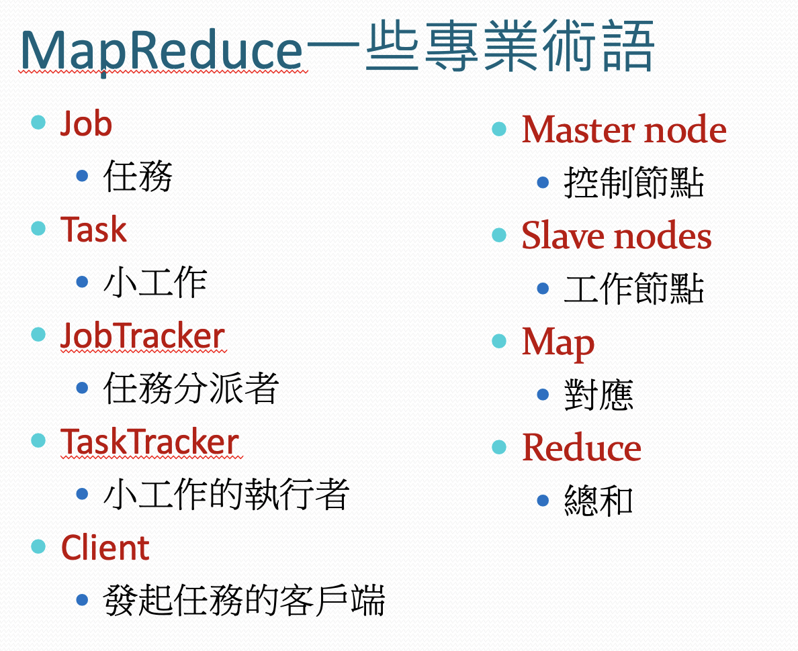
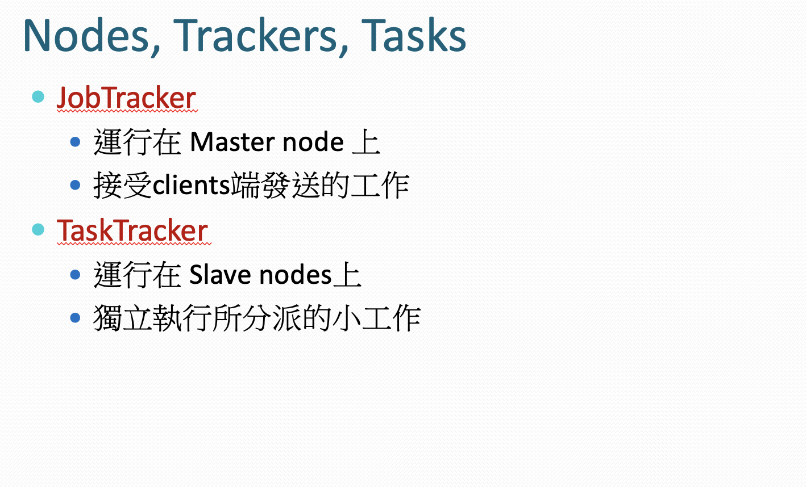
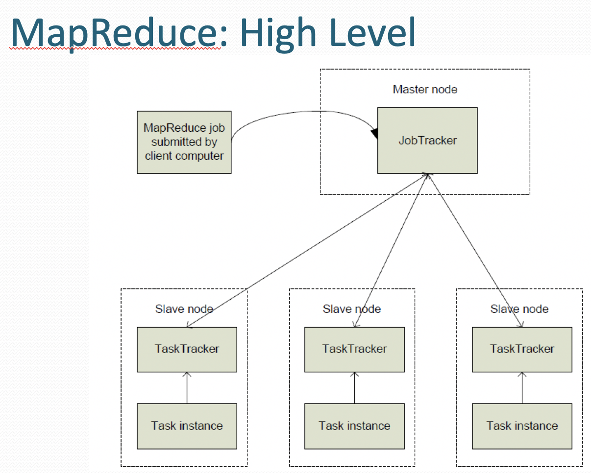
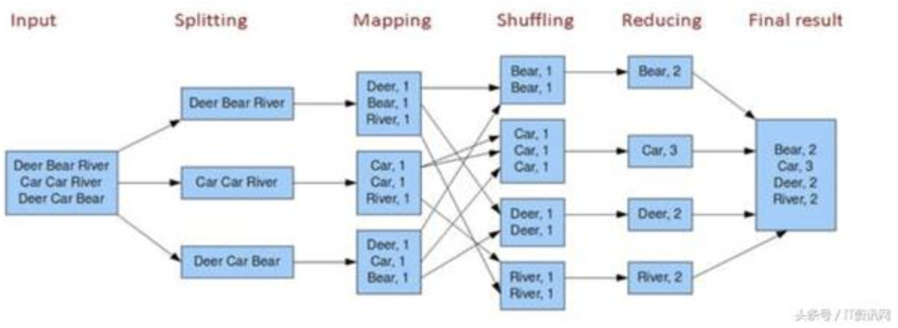
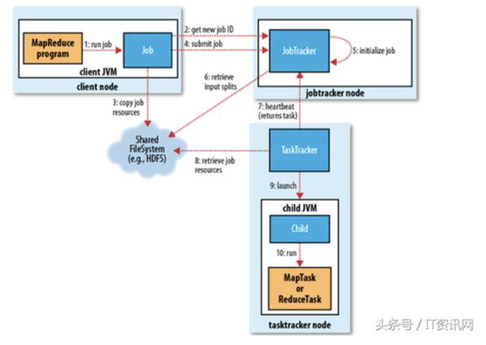

# Terminology

</img>
</img>
</img>

# MapReduce

</img>

1. Splitting - 切分Partition，每個Partition可以是一個獨立，不和其他worker溝通的運算工作
2. Mapping - 僅需在本地端計算的運算工作
3. (Reduce)Shuffling - 開始進行Worker之間的溝通，按照某種hash把同類型資料分在一起
4. (Reduce)Reducing - 進行需要溝通的計算工作，並存取到RDD中

MapReduce這套運算框架的設計重點 : 盡可能地減少機台之間的溝通時間，讓每個Worker可以平行化的做事

## Trouble shooting

1. hash之後某一個worker分到太多運算工作，其他worker分到較少工作，導致要等那個最慢的 - 解法，設計不同的資料，但同樣的reduce結果，觀察會不會hash的比較平均
2. spark會將map function / reduce function重新規劃成spark認定計算比較快的方式，這一點需要透過UI密切關注運算行為是否和想像中一致

## In the hadoop

</img>

JobTracker創建job時，會分配一個job_id，接下來進行一系列操作

| step | description                                                                                                                          | note |
|------|--------------------------------------------------------------------------------------------------------------------------------------|------|
| 1    | 檢查輸入/輸出目錄是否存在，如果存在job就不能正常運作下去(確保一個運行幾小時的任務不會因為輸出目錄問題而產生異常)，JobTracker會拋出錯誤給客戶端             |      |
| 2    | 計算輸入分片，分片計算不出來也算拋出錯誤                                                                                                    |      |
| 3    | 配置job所需資源                                                                                                                        |      |
| 4    | 初始化，主要是將Job放入一個內部的queue                                                                                                    |      |
| 5    | task tracker獲取分片資訊，並創造map任務                                                                                                  |      |
| 6    | tasktracker會啟動心跳機制，心跳間隔可以調整，透過心跳，jobtracker可以觀察worker是否掛了                                                          |      |
| 7    | 執行任務時，job tracker可以透過心跳以及設計好的百分比資訊來追蹤任務進度，當任務做完時，tasktracker會發送成功的訊號，jobtracker就知道他做完了，這會顯示在UI上 |      |

MapReduce的特色

1. MapReduce的計算性能可以隨節點數目增長而保持近似於線性的增長
2. 強項是計算能力，不適合事務處理(?)
3. 不適合小的計算任務，不適合大量小文件計算(建立一個可追蹤進度，可容錯分散式資料集(包含了互相複製，工作記錄等)的cluster初始化成本高)

# MapReduce vs spark

Hadoop是一個Google開源的library，主要實現了兩種設計

1. Google File System(分散式高容錯檔案系統)
2. MapReduce - 高度平行化運算框架

Hadoop難用的地方以及系統設計上的侷限

1. 抽象層次低，需要管理相當多細節(坑多)，使得應用這套框架的使用者較難上手，花費較多開發時間
1. 若需要比較直觀的操作，還要自己繼承Map, Reduce自己重包class, function
2. 現實生活中的任務太過複雜，需要大量的Map function，難以管理
3. 中間過程要存回HDFS，中間過程太多時浪費大量時間在IO上
4. Reduce task一定要等到map task都完成才能開始
5. 由於中間可能要大量IO，只能用於批次處理

# Spark拯救世界

| hadoop| spark|
|-------|------|
|1. 抽象層次低，需要管理相當多細節(坑多)，使得應用這套框架的使用者較難上手，花費較多開發時間 | 設計了一層高階API，RDD(彈性是分布資料集)，講白了就是包成一個好用的class，邀請社群包裝Python, R API |
|2. 若需要比較直觀的操作，還要自己繼承Map, Reduce自己重包class, function | RDD寫了很多好用方法，Sort, Join等 
|3. 現實生活中的任務太過複雜，需要大量的Map function，難以管理|每種操作都return RDD物件，而且存在記憶體裡面，統一物件格式
|4. 中間過程要存回HDFS，中間過程太多時浪費大量時間在IO上|存記憶體，不用IO了|
|5. Reduce task一定要等到map task都完成才能開始|分區相同的轉換可以在一個task以streanmming進行，只有分區不同才需要等其他worker|
|6. 由於中間可能要大量IO，只能用於批次處理|開始支援streamming

# Reference

[大數據技術: MapReduce設計原理及使用案例呈現](https://kknews.cc/zh-tw/code/e3254ry.html)

[MapReduce原理介紹ppt](http://dns2.asia.edu.tw/~jdwang/TeachingCourses/CloudProgramming/CH6.pptx)

[Spark 学习: spark 原理简述](https://zhuanlan.zhihu.com/p/34436165)
