# Spark Join
[Optimizing Apache Spark SQL Joins: Spark Summit East talk by Vida Ha](https://www.youtube.com/watch?v=fp53QhSfQcI)

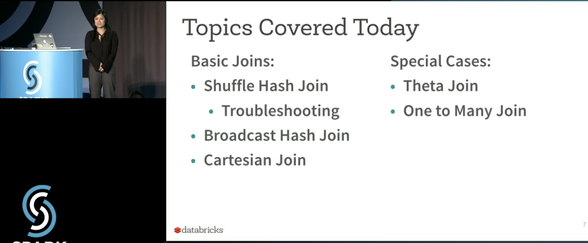

# Shuffle Hash Join

Most basic type of join

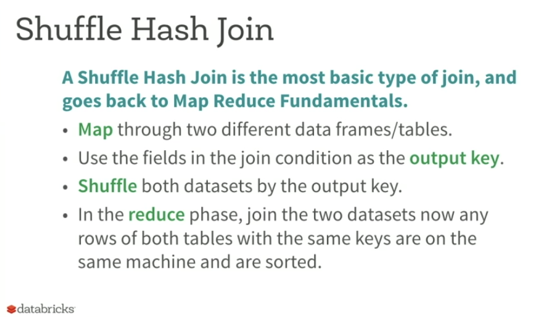

the key and the hash is a label to make data to an excutor and finally merge data.

TODO - key and hash?

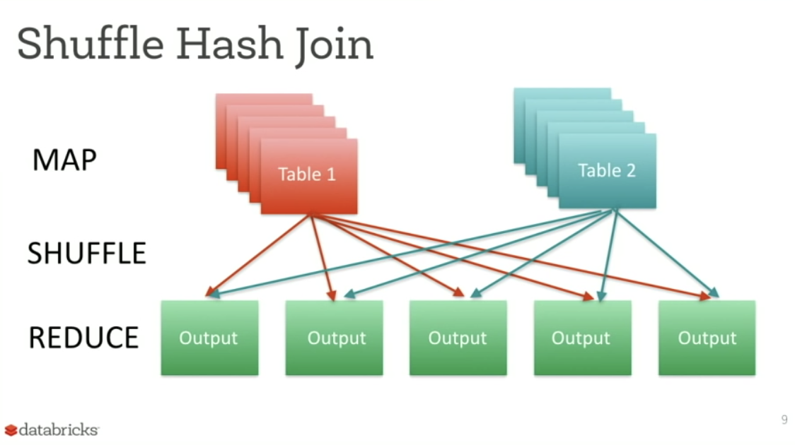

Work best when : 

* Distribute evenly with the key you are joining on.
* Have an adequate number of keys for parallelism.
  * if you have 200M rows of data. you won't use 200M keys(a lot of shuffle steps)

## Shuffle Hash Join Performance Issue

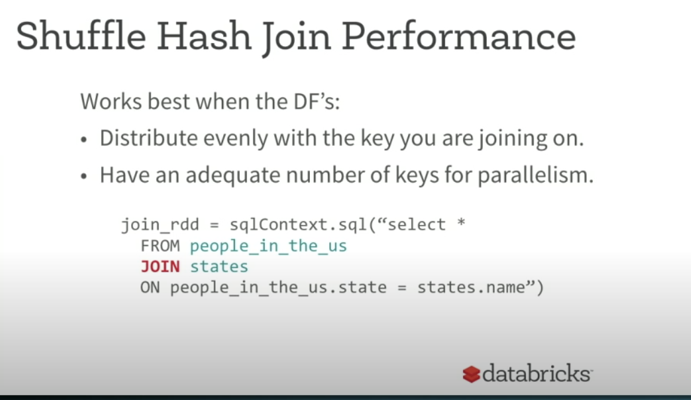

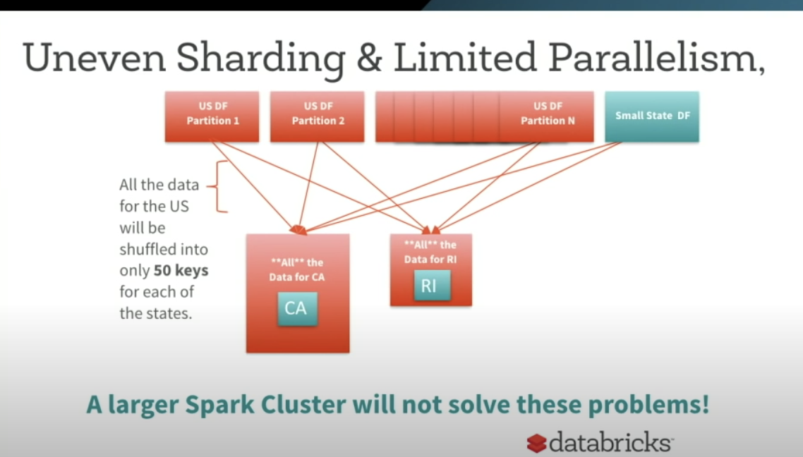

since we use `state.name` as a join key.

big table : people in U.S.

small table : U.S. state

CA : a lot of people

RI : few people

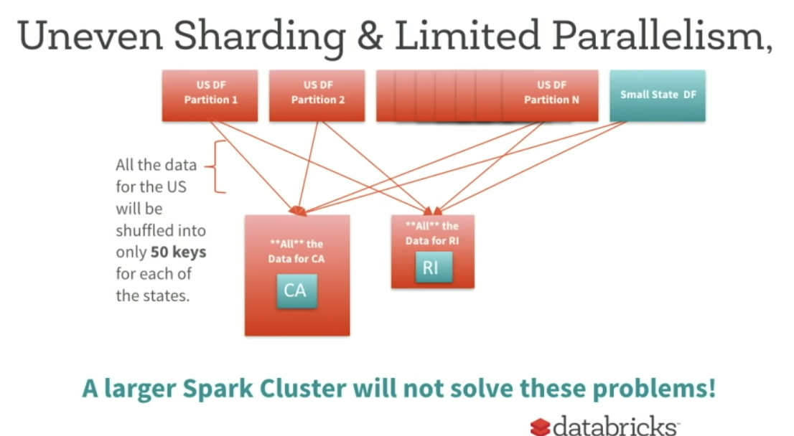

You only have 50 keys.

If you increase your workers above 50. you won't get better performance

## Another case

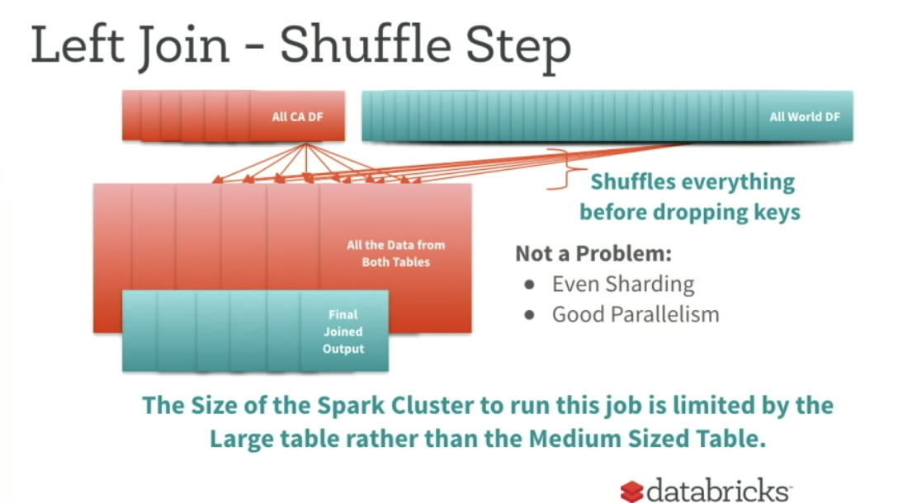

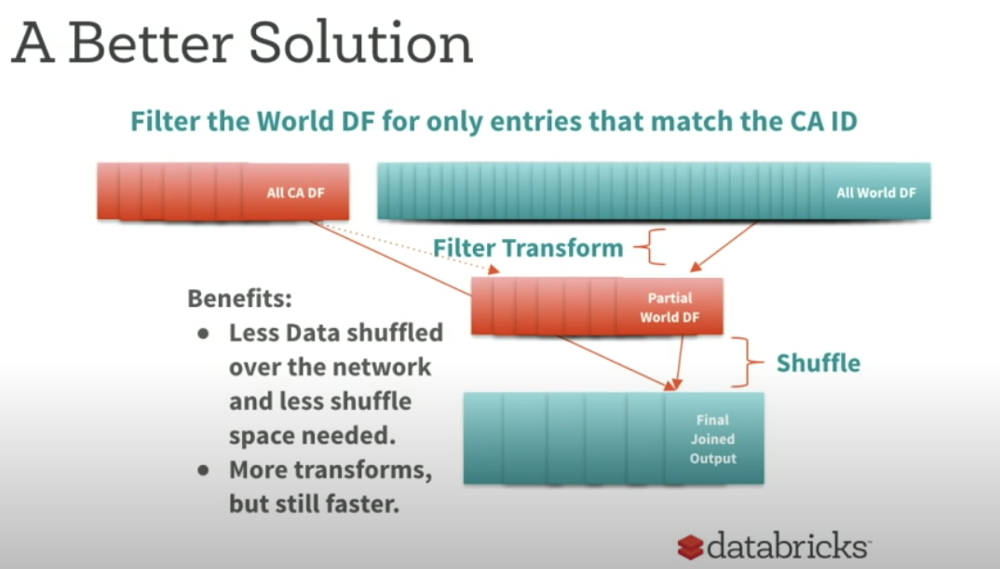

## Detecting Shuffle Problems

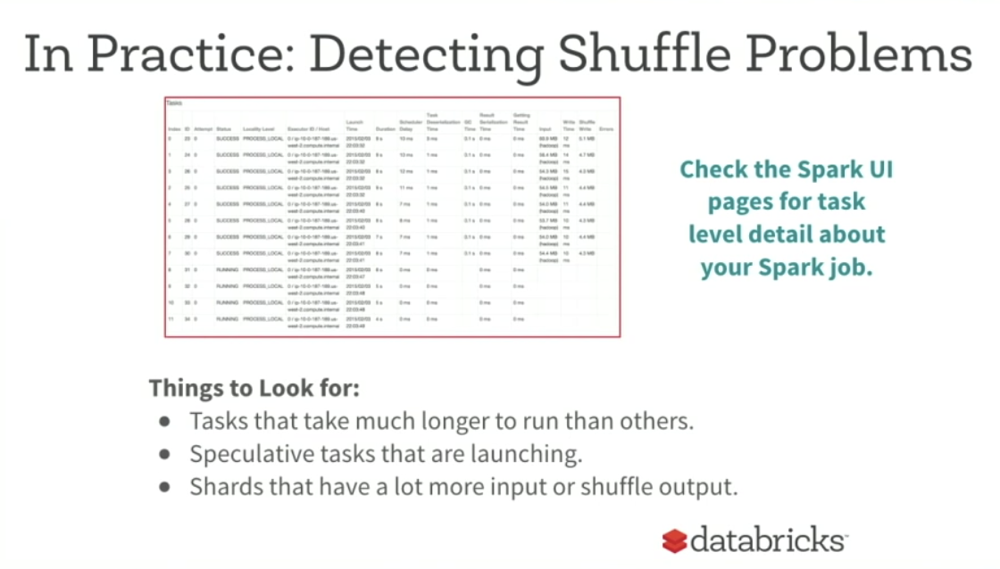

check the output size evenly or not by `ls your_output_file`.

# Broadcast Hash Join

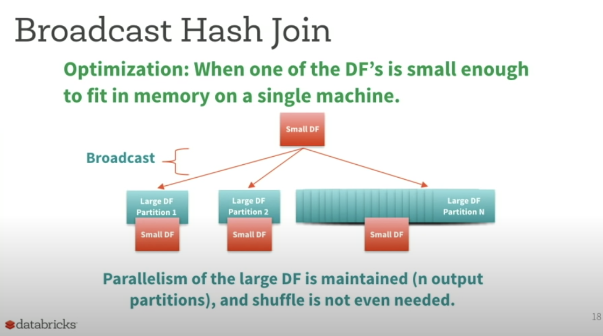

small table vs big table - use broadcast hash join 

# Cartesian Join

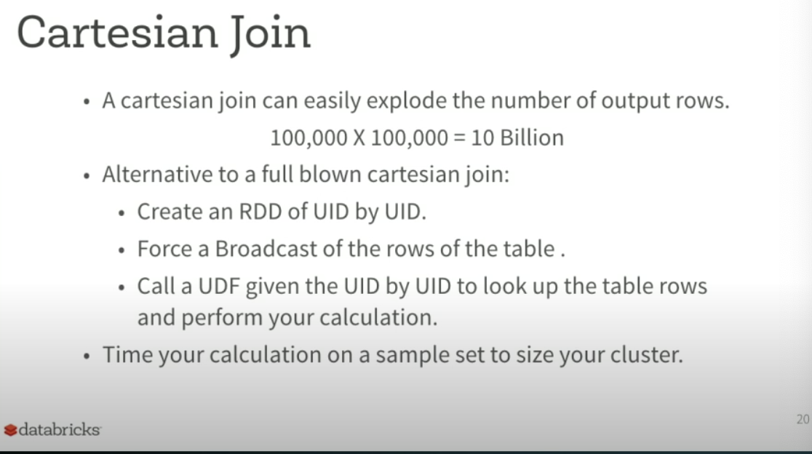

TODO