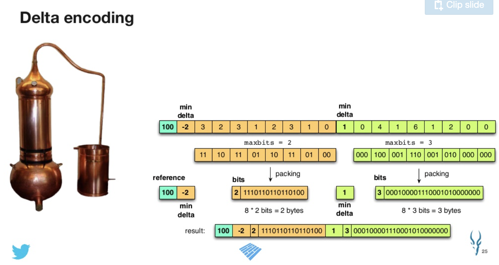

# Apache Parquet 2.0

[official website](https://parquet.apache.org/)

[slide](https://www.slideshare.net/cloudera/hadoop-summit-36479635?ref=https://parquet.apache.org/)

Apache Parquet is a columnar storage format available to any project in thr Hadoop ecosystem, regardless of the choice of data processing framework, data model or programming language.

</img>

</img>

# Efficiency

</img>

</img>

</img>

# Parquet

Interoperability : 互通性

</img>

</img>

## Interoperability

we want this thing cross language, like json

</img>

</img>

## Enabling efficiency

</img>

row layout and column layout is different. 

</img>

</img>

## Properties of efficient algorithms

</img>

</img>

## Encodings in Apache Parquet 2.0

</img>

### Delta encoding

</img>

in short, create a reference, transform the value by reference, then we can compress the data size!

</img>

</img>

</img>

### Binary packing

</img>

</img>

</img>

by this technique, we can compress data well.

PKey : 20%~40%
FKey : 25%~60%

</img>

</img>

</img>

## Parquet roadmap 2.x

</img>

</img>