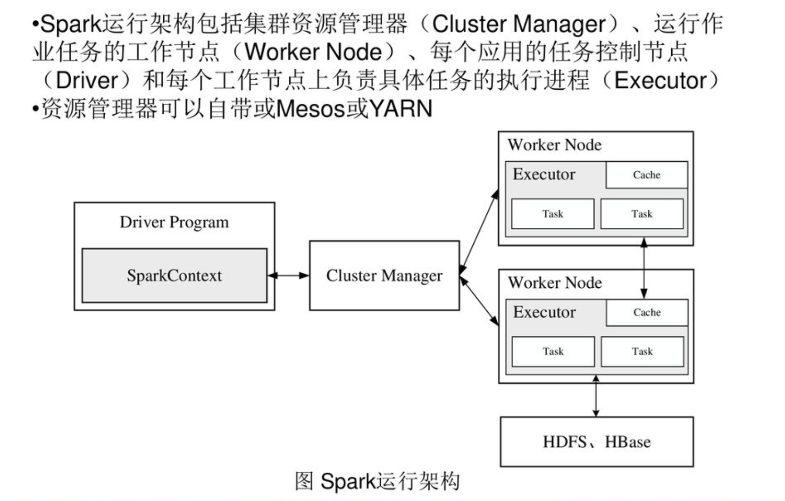
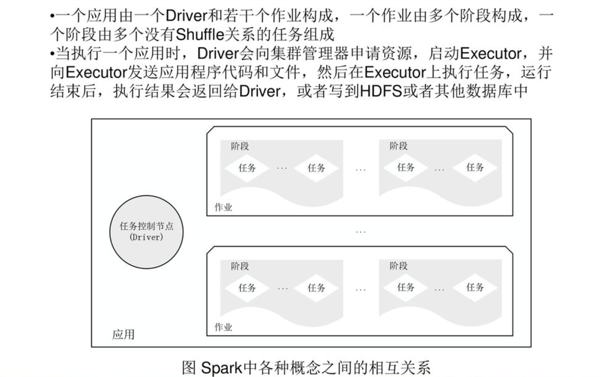

# Spark 系統架構

## 5個名詞
1. Application : 基於Spark的使用者程式，包含一個Driver Program和Cluster中的多個Executor

2. Driver : 執行Application中的main()，並創建SparkContext

3. Executor : 是為了Application在Worker Node上的一個**進程**，進程負責執行Task，並將資料存在記憶體中或是硬碟上，每個Application有各自獨立的Executors

4. Cluster Manager : 從叢集獲取資源的外部服務，例如Local, Standalone, Mesos 或是 Yarn

5. Operation : 作用於RDD的各種操作，分為Transformation以及Action

## 2種節點

整個Spark Cluster中，分為Master節點以及Worker節點

Master Node : 節點上常駐Daemon進程以及Driver進程，Master負責將任務變成可平行執行的Tasks，並負責處理出錯時的問題處理，Master Node主要進行Worker Node的負載管理

Worker Node : 節點上常駐Worker Daemon，並執行任務

Spark支援不同的運作模式，包含Local，Standalonem Mesoes, Yarn

不同的運作模式會將Driver 調度到不同的節點上實行，local一班用於本地端測試

每個Worker上存在一個或是多個Executor進程，Executor擁有一個線程池，每個線程負責一個Task的執行，根據Executor上CPU-core的數量，可以並行多個和Core一樣數量的Task

</img>

上圖可以看到Driver會建立一個SparkContext，接著和Cluster Manager溝通，Worker則是工作的機器，裡面會放多個Executor，Excutor就是process，根據Worker有的硬體資源進行計算

## 工作單元

1. RDD(Resillien Distributed Dataset)彈性分散式資料集
2. DAG(有向無環圖)，用於描述RDD之間的上下游關係
3. Task : 在Executor中描述工作單元
4. Job : 一個Job包含多個RDD以及在RDD上的各種操作
5. Stage : Job的調度單位，一個Job中有多組Task，多組Task之間以是否進行Shuffle切分Stage

## 工作單元的關係圖

Scale : 

1. Job > Stage > Task
2. DAG > RDD (事實上是由RDD的上下游關係組成DAG)

</img>

# Spark的基本運作流程

1. Driver建立SparkContext
2. 資源管理器為Executor分配資源，並啟動Executor
3. SoarkContext根據user寫的程式碼(RDD)建立DAG
4. DAG提交給DAGScheduler解析成Stage，並將每個Stage中的Taskset交給TaskScheduler
5. Executor像SparkContext申請Task
6. TaskScheduler將Task發給Executor執行
7. Task在Executor中執行，結果回傳給TaskScheduler，各個TaskScheduler將結果回傳給DAGScheduler，完成計算
8. 釋放資源

</img>

# Ref

[Spark 学习: spark 原理简述 550+ 贊同](https://zhuanlan.zhihu.com/p/34436165)

[spark 設計和原理 LinkedIn Slide](https://slidesplayer.com/slide/17941050/)