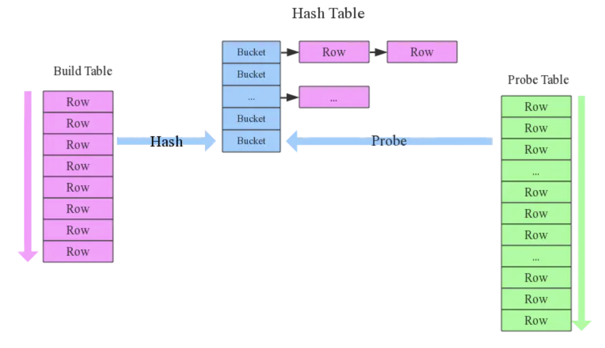
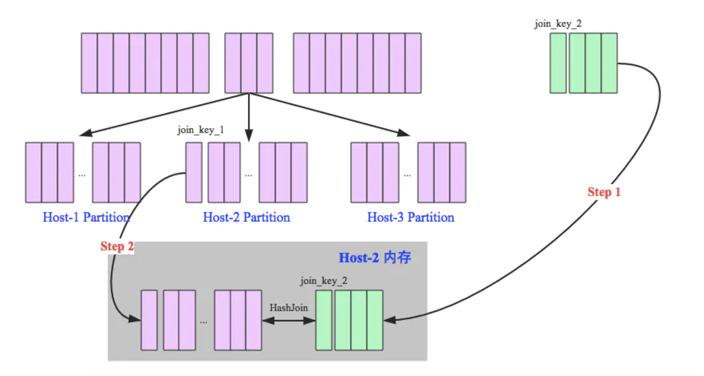
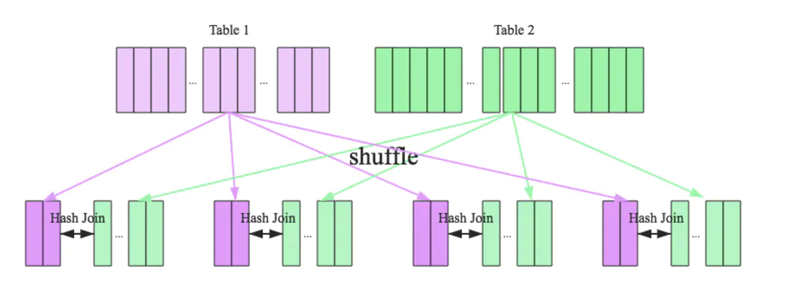

# Ref

[Spark难点解析：Join实现原理](https://www.jianshu.com/p/97e76dddcbfb)

[Spark的五种JOIN策略解析](https://jiamaoxiang.top/2020/11/01/Spark%E7%9A%84%E4%BA%94%E7%A7%8DJOIN%E6%96%B9%E5%BC%8F%E8%A7%A3%E6%9E%90/)

# Hash Join

2018, Oct, 目前SparkSQL支援三種JOIN，shuufle hash join, broadcast hash join, sort merge join，前兩者追根究底都屬於hash join，只不過hash join之前是broadcast還是shuffle

Hash Join

考慮一個簡單的Inner Join 

</img>

1. 小的表作為映射表(Build Table)，建立Hash Table，供大表快速查詢

2. 大的表作為Probe Table(探測表)，逐列掃一遍來詢問Hash Table該值存不存在

3. 考慮小的表大小有$a$列，大的表有$b$列，兩張表都只會被掃描一次，算法效率是$O(a+b)$，比Cross join的$O(ab)$要快得多

而以上算法設計沒有考慮到分散式的運算，現在來可慮分散式，那麼就有了`Broadcast Hash Join`, `Shuffle Hash Join`

# Broadcast Hash Join

小表(partitions $p$) and 大表(partitions $q$)

1. broadcast 階段 - 將小表broadcast到大表的所有主機，從driver送出
2. hash join階段 - 在每個Excutor上執行單機版hash join

broadcast的大小限制可以由`spark.sql.autoBroadcastJoinThreshold`來條整

由於broadcast之後以定會做hash，如果你用大表，Excutor就會OOM，而且broadcast會非常慢，因為你透過網路傳輸很大的資料

也因此隨著要broadcast的表個越來越大，消耗越來越多網路資源，使得另一種做法產生，也就是 Shuffle Hash Join

</img>

# Shuffle Hash Join

Output Table 按照JOIN key分區，將大表格repartition成join key的分區，充分利用cluster的資源來平行化

1. shuffle階段 - 分別將兩張表按照JOIN key分區，將相同JOIN key的紀錄repartition到同一個節點上
2. hash join階段，每個分區節點上的資料單獨執行單機hash join

</img>

但因為還是會把一張表hash，因此還是不能用太大的表，否則會OOM，那麼如果真的兩張表都超大呢?

答案也很簡單，不做hash table，但做排序，所以有了 Sort-Merge Join

# Sort-Merge Join

SparkSQL 對兩張大表join使用了 sort-merge join，分成三個步驟

1. shuffling - 將兩張大表根據JOIN key repartition，兩張資料表會重新分布到cluster上，以便分散式平行處理
2. sort - 對每個分區節點的兩張資料表都進行排序
3. merge - 對排好旭的兩張分區表進行比較，分別掃一遍兩個有序序列，遇到相同key就merge，否則就取更小一邊的key(這一點要畫出來看一下)

</img>

但spark其實有一些作弊的地方，在repartition的階段就會偷偷排序好，所以shuffle之後其實不後在sort一次，可以直接merge

# 結論 - 如何優化

1. DateWarehouse設計時避免大表vs大表JOIN查詢
2. SparkSQL可以根據Excutor資源，bandwidth將`spark.sql.autoBroadcastJoinThreshold`調大，讓更多JOIN實際上執行為broadcast hash join