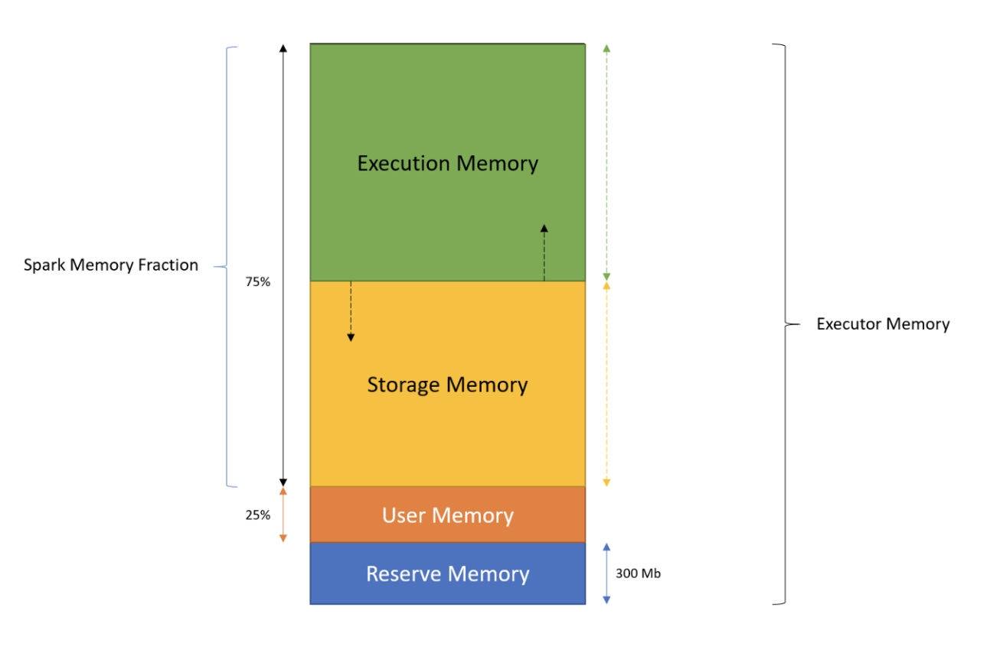

# Ref

https://medium.com/swlh/spark-oom-error-closeup-462c7a01709d

# Spark Unified Memory managemen

</img>

1. Reserve Memory - 系統保留記憶體(per excutor) - 300MB
2. User Memory - 使用者記憶體 - 25% of total executor memory
   1. 放使用者定義物件，例如hash map.
   2. 儲存 RDD 相依圖(RDD dependency)
   3. 不會溢出到硬碟
3. Memory Fraction - Spark 使用，75% of total executor memory

Memory Fraction 又分為 Executor Memory, Storage Memory

4. Execution Memory - Spark 用於處理資料或是生成資料
   1. RDD transformation
   2. shuffle
   3. join
   4. sort
   5. 如果不夠，會去拿硬碟的空間
5. Storage Memory - 暫存(Cached), broadcast variables 會存在這裡，不夠會去拿硬碟空間
6. Execution Memory / Storage Memory 之間的界線是浮動的，端看誰的需要比較多

# Driver side OOM and Executor OOM

## Excutor OOM

1. YARN Memory overhead(If spark is running on YARN) - 用於儲存 spark 內部物件，語言相關物件(java, scala, python), thread stacks, NIO buffers, 通常有一個32GB的executor會有2GB留給YARN overhead memory

set by : 

`spark.yarn.executor.memoryOverhead`

2. 平行化程度過高 - 不適合的核心數(cores) for executor, 這會讓我們需要處理過多的partition, 因為每個partition都會有自己的metadata和memory overhead, 由於是平行地跑，這些partition會需要從 executor 抽取memory出來，導致了 oom

在設置excutor數量時，要注意的是

1. 太少核心數(cores) - 平行化程度不夠
2. 太多核心數(cores) - 平行化程度過高，使得partition metadata, partition memory overhead 導致oom

一般常見是從 5 excutor-cores 開始設置，並且啟動 `dynamic resource allocation`(動態資源收集)

set by

```
spark.default.parallelism
spark.executor.cores

```

3. partition 過大 - 如果 excutor 正在執行一個超大的partition，會丟出 oom error, 這通常來自於檔案的解壓縮或是檔案的 meta data, 可以透過 partition size 來調整

set by

```
spark.sql.shuffle.partitions

```

4. 垃圾回收負擔過大 (GC Overhead limit exceeded) - 可透過增加 excutor memory來解決，或者把 `spark.storage.memoryFraction` 調大一些，讓spark可以收集到更多記憶體

## Driver OOM

1. Collect - 將分散在excutor的資料收集回driver，可能會把driver記憶體塞爆

```
spark.driver.maxResultSize
```

2. Broadcast join - broadcast join 有設置一個threshold，超過此threshold時，資料傳送到excutor就會引發oom

```
spark.sql.autoBroadcastJoinThreshold
```